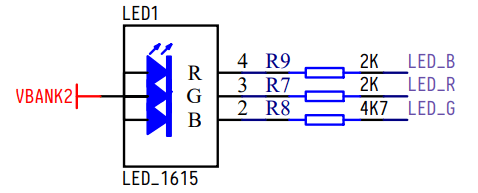
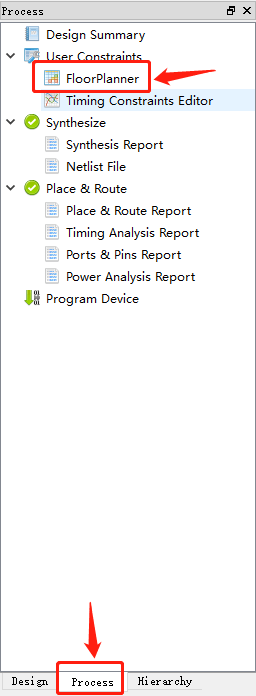
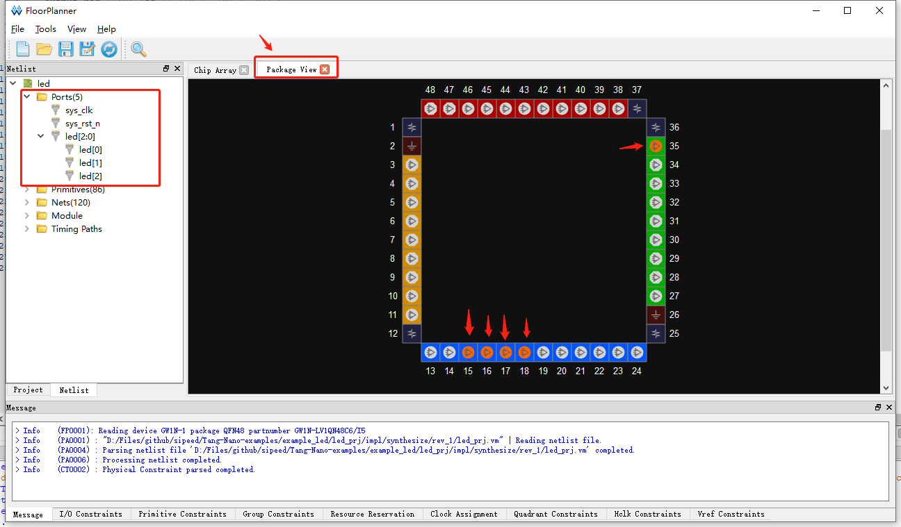
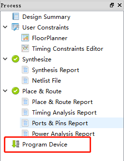
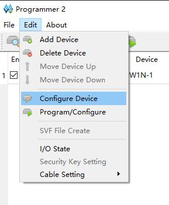

# Instance process

New Project -> Add Source Code File -> Add Timing, Pin Constraints -> Synthesis -> Burn

Before reading this document, please make sure you have seen [Gowin Cloud Source Software User Guide] (http://cdn.gowinsemi.com.cn/SUG100-1.8_Gowin%E4%BA%91%E6%BA%90%E8%BD%AF%E4%BB%B6%E7%94%A8%E6%88%B7%E6%8C%87%E5%8D%97.pdf), Chapter 5 Cloud Source Software Usage

The source code of this experiment: [https://github.com/sipeed/Tang-Nano-examples/tree/master/example_led](https://github.com/sipeed/Tang-Nano-examples/tree/master/ Example_led)

# Verilog Prerequisites

Here only introduce the relevant syntax that will be used next, more can refer to "Verilog Digital System Design Tutorial"

The basic design unit of Verilog is the module, and each Verilog program consists of four main parts: port definition, I/O description, internal signal declaration and function definition.

The module is like the black box we usually mentioned. When we implement the module, we don't need to care about the inside of the module. We only need to instantiate the module according to the input and output format defined by the module, and provide input to the module. Already working

a module grows like this

```
Module block (input a, output b);
Reg [width-1:0] R_1;

Assign b = a;
Always @(posedge clk or negedge reset_n)
Begin
// do something
End

Endmodule
```

The overall structure of the module consists of module and endmodule. The module is followed by the definition of the module interface, which declares whether the direction of the port is input or output.

Internal signals are sometimes used inside the module, and the internal signals are of type wire and reg.

The definition of the function can be done through the assign and always blocks. Assign is one of the most common methods for describing combinatorial logic; always a block machine can be used to describe combinatorial logic, as well as to describe sequential logic

# Pin usage

The onboard is a three-color RGB light, the schematic is as follows



The pin distribution used by the entire program is as follows

| port | I/O | pin | desc |
| --------- | ------ | --- | ---------- |
| sys_clk | input | 35 | Clock Input Pin |
| sys_rst_n | input | 15 | System Reset Foot |
| led[0] | output | 16 | Green Light |
| led[1] | output | 17 | Blue Light |
| led[2] | output | 18 | Red Light |

# Programming

The clock of this system is 24Mhz, one machine cycle is 1/24M s, which means 0.5s every 12000000 clock cycles.

In the program, calculate 12000000 clock cycles by counter, and wait for 0.5s. After the time is up, set counter to 0 and change the color of the LED.

```
Module led (
    Input sys_clk, // clk input
    Input sys_rst_n, // reset input
    Output reg [2:0] led // 110 G, 101 R, 011 B
);

Reg [23:0] counter;

Always @(posedge sys_clk or negedge sys_rst_n) begin
    If (!sys_rst_n)
        Counter <= 24'd0;
    Else if (counter < 24'd1200_0000) // 0.5s delay
        Counter <= counter + 1;
    Else
        Counter <= 24'd0;
End

Always @(posedge sys_clk or negedge sys_rst_n) begin
    If (!sys_rst_n)
        Led <= 3'b110;
    Else if (counter == 24'd1200_0000) // 0.5s delay
        Led[2:0] <= {led[1:0], led[2]};
    Else
        Led <= led;
End

Endmodule
```

# Pin constraint

In order for fpga to implement the function of the code, it is also necessary to constrain the pin operations involved in the code to the actual pins of fpga.

As shown below, click process in the workspace on the left, then double-click FloorPlanner



The first click in the project, you may be prompted to create a file, click OK

In the pop-up window, switch to Package View, drag the port under Ports to the corresponding pin of fpga, save it, as shown below



# Comprehensive

In the workspace on the left, right-click Synthesize or Place&Route, there will be a run option, click


# Burn to the development board

There are two options, one is to burn to sram, the other is to burn to flash.

Burning to sram is faster, but there is no firmware in fpga after power-off; burning to flash can save the firmware before burning after the system is powered off.

Burning is done through the Programer

Double-click on the Program Device in the left workspace to open the Programer.



However, before using Programer, you need to be aware that you can use Programer after both Synthesize and Place&Route are completed, otherwise the software will report error `Bitstream file dose not exists`


Linux users need to pay attention

> The programmer in the Linux installation package is for Linux version Red Hat 5.10. For the Red Hat 6/7 version of the programmer, please download the installation on the official website and replace the installation package with the file in the Gowin cloud source software installation package. Clip "Programmer".

## Change the burning position

To select the location where the firmware is programmed, you can click Edit -> Configure Device when the chip is selected.



In the pop-up window, select the location you want to burn. The flash is selected here. The default burning location is sram.


## Burning

After selecting the burning location, you can burn the firmware, click on the menu bar to burn.


